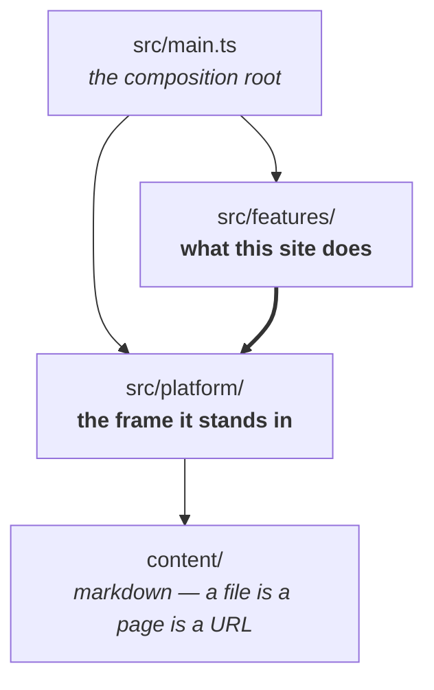
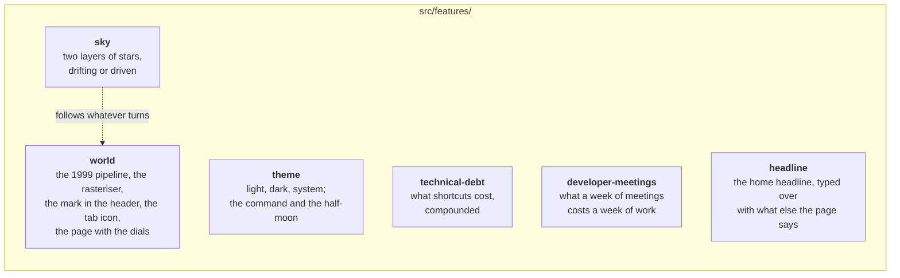
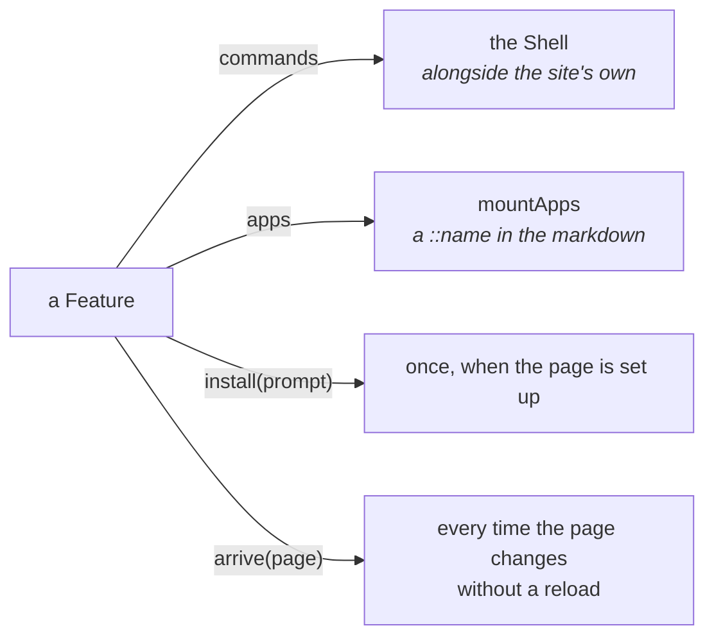
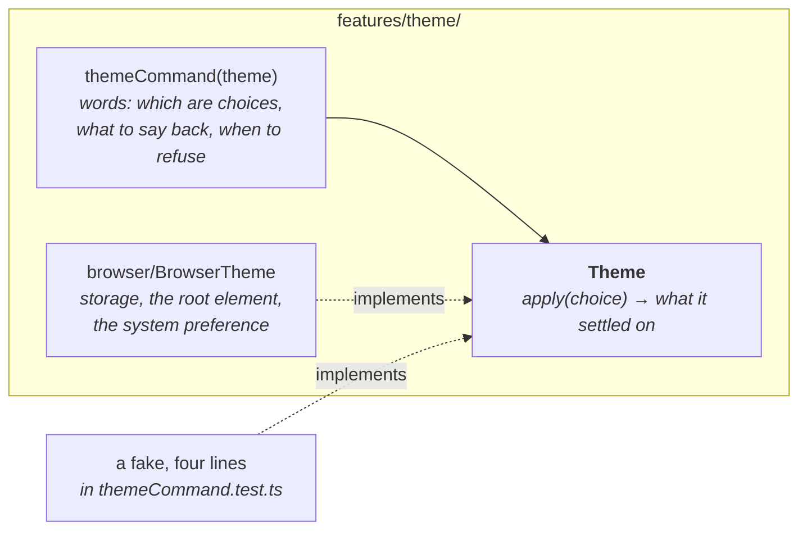
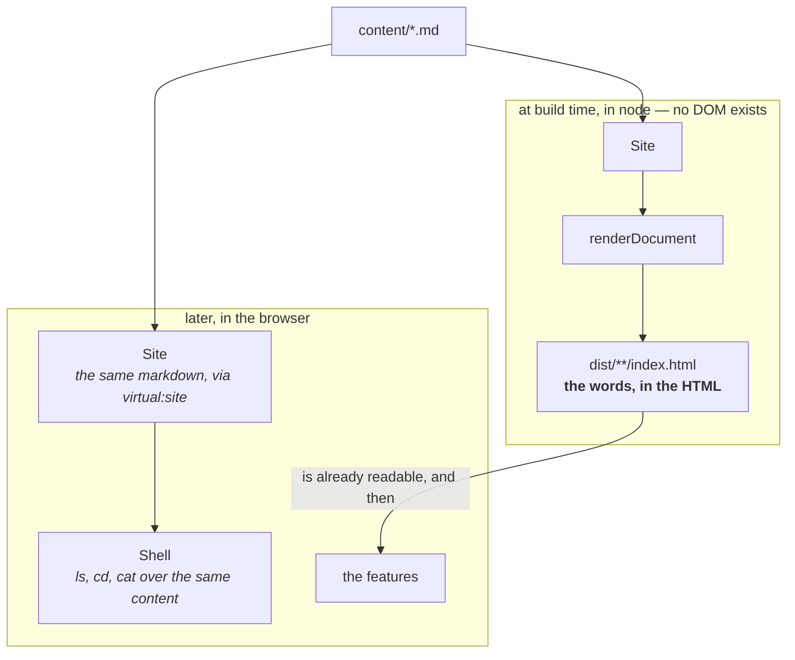

# Architecture

A static site with no runtime dependencies. The one requirement that outranks
everything else is in `CLAUDE.md`: **the content is in the HTML**. Every shape
below follows from it, and `src/architecture.test.ts` is what keeps them true —
each claim here is a test there, and breaking one fails `npm test`.

---

## 1. Two halves



`src/platform/` is everything that would still be here if every feature were
deleted: the site, the markdown, the shell over it, the page, the terminal, the
navigation between pages.

`src/features/` is one folder each. A feature owns all of itself — its rules,
its commands, its screen, its storage — so that deleting the feature is
deleting the folder and its line in `allFeatures.ts`.

**The thick arrow only points one way.** The frame never imports a feature. If
it did, you could not read the frame without knowing what a *theme* or a *sky*
was, which is exactly the state this replaced.

---

## 2. The features



Only one dotted line crosses between features, and §5 is about it. Everything
else here is an island: cut it out and nothing else notices.

---

## 3. What a feature plugs into

`Feature` is the whole contract, and every part of it is optional.



`main.ts` collects those four things from `allFeatures` and hands them to the
frame. The frame knows the shape and no feature by name.

---

## 4. A command, and the thing it causes

The shell returns an `Outcome`: text, html, an error, and the two effects that
are the shell's own business — `navigate`, because a shell over a site moves
around it, and `clear`, because a shell has a screen.

A feature's effects are **not** on that list. `Outcome` used to carry a `theme`
field, and that was the frame carrying a feature's vocabulary. Instead:



The arrow into the port is the point: the command depends on what it needs, not
on the browser that provides it. The half worth testing is the half about
words, and it is tested without a DOM.

---

## 5. The connector: the sky follows the world

The stars used to live inside the worlds app, on the reasoning that a hand on
the world moves them together. True — and no reason for one to be written
inside the other.

```mermaid
sequenceDiagram
  participant hand as a hand on the world
  participant world as features/world
  participant signal as Signal&lt;Turning&gt;
  participant sky as features/sky

  hand->>world: drag
  world->>signal: send({ byRadians, tiltedBy, seconds })
  Note over signal: the world does not know<br/>whether anyone is listening
  signal->>sky: follow(...)
  sky->>sky: take the wheel from the CSS drift,<br/>then slide the stars
```

The world announces to nobody in particular. The sky is the one that decides to
be somebody, so the import points **from the sky to the world** — a sky that
follows a world is a detail of the sky; a world that turns is a detail of
nothing. Delete `features/sky/` and the world still turns and still says so, to
an empty room, which costs nothing.

---

## 6. The same code, twice: node and the browser

This is the shape the founding requirement forces, and the one that would
actually crash if it were broken.



A search engine, a reader with no JavaScript, and a reader on a slow line all
get the finished page. Everything the script does afterwards is an improvement
on a page that already works.

Which is why **a folder named `browser/` is the only place the DOM exists**.
`renderDocument` runs in node; anything it can reach that said `document` would
crash the build. The test walks the import graph from `renderDocument` and
checks every file it reaches.

The one place the frame names a field belonging to a feature is
`declaredAppearance`, and it is there for the same reason: a page that insists
on night has to *be* night in the HTML, before a stylesheet paints and long
before a script runs. So the document writes `data-page-theme` and `data-sky`
from the front matter, the navigation keeps them in step across a move, and the
features read them back off the root. Nothing else in the frame knows what
`dark` or `stars` mean.

---

## 7. The rules, and where they are enforced

| Claim | Enforced by |
|---|---|
| The DOM lives only in folders named `browser/` | `architecture.test.ts` |
| `src/platform` never imports `src/features` | `architecture.test.ts` |
| Nothing reachable from `renderDocument` touches the DOM | `architecture.test.ts` |
| Every feature folder is installed in `allFeatures` | `architecture.test.ts` |
| Every feature folder is drawn in this file | `architecture.test.ts` |

The last one is why these diagrams should still be right when you read them: a
feature that is not in them fails the build.
