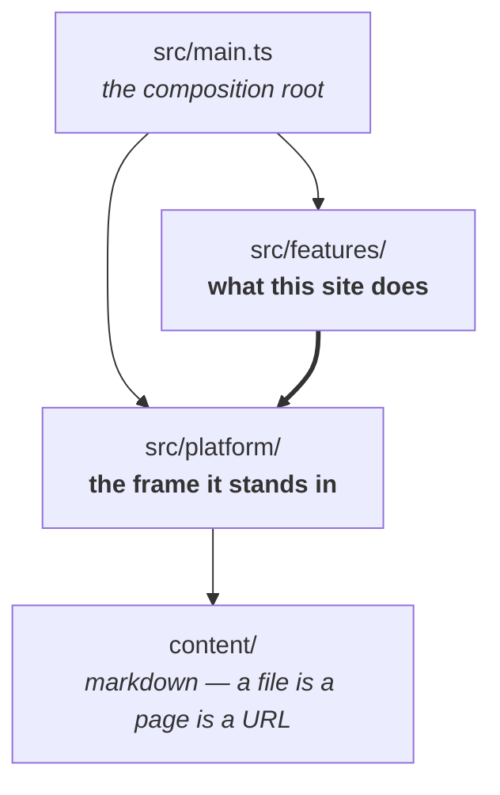
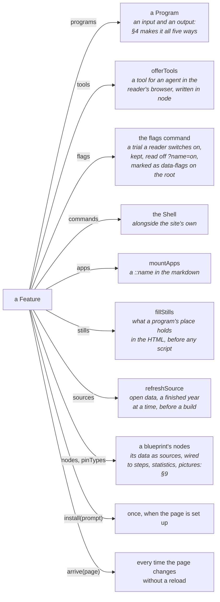
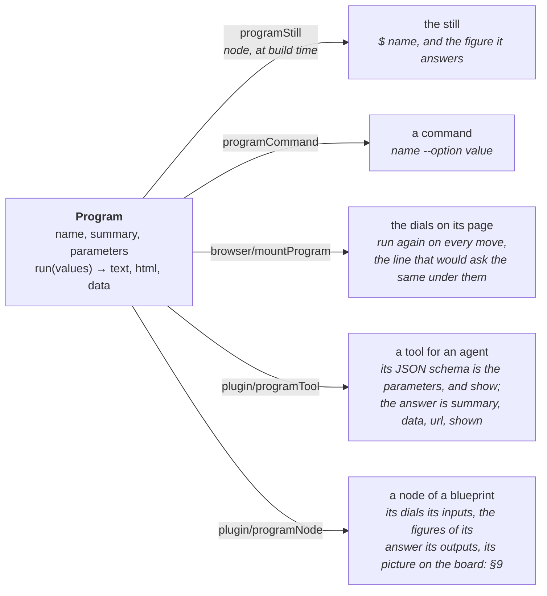
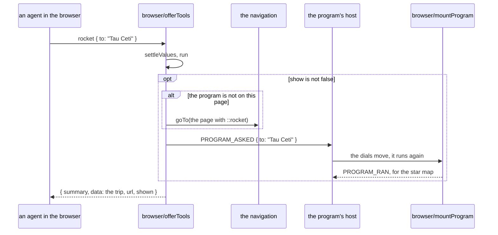
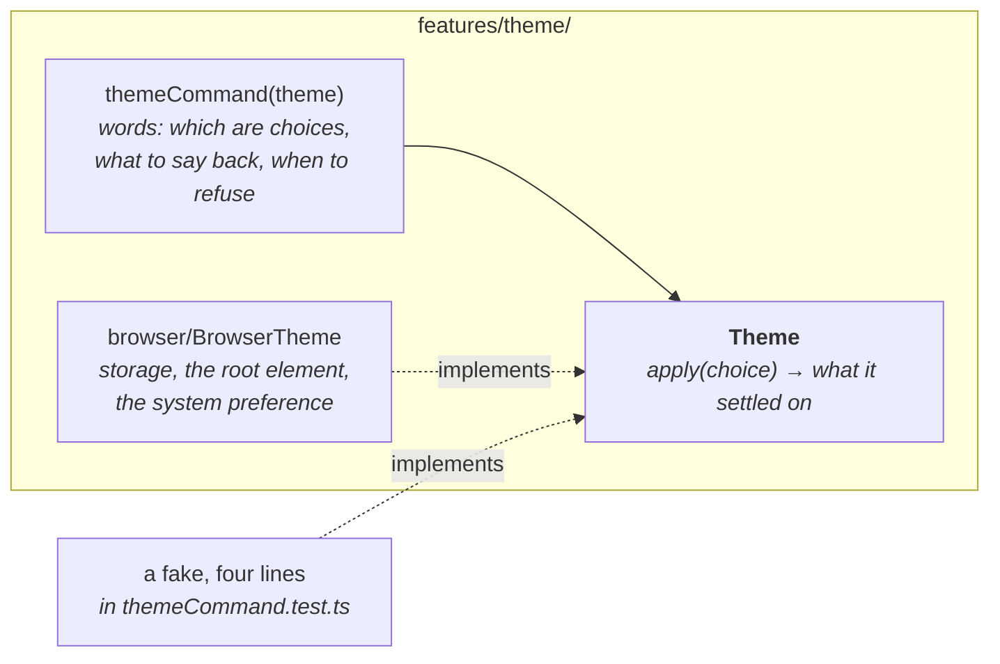
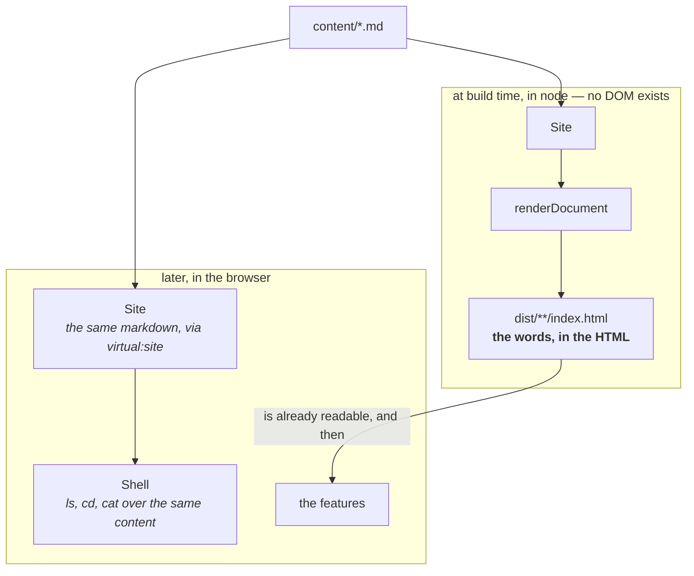
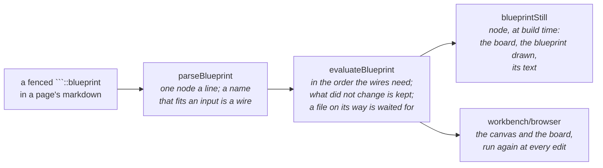

# Architecture

A static site with no runtime dependencies. The one requirement that outranks
everything else is in `CLAUDE.md`: **the content is in the HTML**. Every shape
below follows from it, and `src/architecture.test.ts` is what keeps them true —
each claim here is a test there, and breaking one fails `npm test`.

---

## 1. Two halves

```mermaid
graph TD
  main["src/main.ts<br/><i>the composition root</i>"]
  features["src/features/<br/><b>what this site does</b>"]
  platform["src/platform/<br/><b>the frame it stands in</b>"]
  content["content/<br/><i>markdown — a file is a page is a URL</i>"]

  main --> features
  main --> platform
  features --> platform
  platform --> content

  linkStyle 2 stroke-width:3px
```

`src/platform/` is everything that would still be here if every feature were
deleted: the site, the markdown, the shell over it, the page, the terminal, the
navigation between pages.

`src/features/` is one folder each. A feature owns all of itself — its rules,
its commands, its screen, its storage — so that deleting the feature is
deleting the folder and its line in `allFeatures.ts`.

**The thick arrow only points one way.** The frame never imports a feature. If
it did, you could not read the frame without knowing what a *theme* or a *sky*
was, which is exactly the state this replaced.

---

## 2. The features

```mermaid
graph LR
  subgraph fs["src/features/"]
    world["<b>world</b><br/>the pipeline of 2000, the rasteriser,<br/>the mark in the header, the tab icon,<br/>the page with the dials"]
    theme["<b>theme</b><br/>light, dark, system;<br/>the command and the half-moon"]
    sky["<b>sky</b><br/>two layers of stars,<br/>drifting or driven"]
    debt["<b>technical-debt</b><br/>what shortcuts cost,<br/>compounded"]
    meetings["<b>developer-meetings</b><br/>what a week of meetings<br/>costs a week of work"]
    headline["<b>headline</b><br/>the home headline, typed over<br/>with what else the page says"]
    posttests["<b>post-tests</b><br/>a blog post compiled into its test,<br/>live, with the compiler's rules"]
    fishmarket["<b>fish-market</b><br/>the Dutch auction of 2000 and the<br/>agents that won it, with a seat for yours"]
    lagoon["<b>lagoon</b><br/>a commons that breeds, the bots<br/>that share it, and a seat for yours"]
    maze["<b>maze</b><br/>the VRML maze generator of 2001,<br/>its dig and its spheres, Java's random"]
    firstnetwork["<b>first-network</b><br/>letters told apart by backpropagation,<br/>the visitor's own among them"]
    bowlingkata["<b>bowling-kata</b><br/>Robert C. Martin's kata, commit<br/>by commit, each one run in the page"]
    testsasexamples["<b>tests-as-examples</b><br/>the same tests against a dispatcher<br/>refactored, and one with a bug"]
    gherkingenie["<b>gherkin-genie</b><br/>a scenario, the steps it wishes for,<br/>and the scenario run once they exist"]
    smallsteps["<b>small-steps</b><br/>a row that fills at random: a red<br/>put right at once, clean steps between"]
    guesstherule["<b>guess-the-rule</b><br/>sequences marked by a hidden rule,<br/>and the rule to find, from 2020"]
    stepnames["<b>step-names</b><br/>a sentence read as a method,<br/>and the tests a post becomes"]
    architecture["<b>architecture</b><br/>the source read as a graph:<br/>boxes, arrows, the rules on them,<br/>and its history: what changes, and with what"]
    portfolio["<b>portfolio</b><br/>a flag: the lists with pictures<br/>as cards the width of a program"]
    fibergochi["<b>fibergochi</b><br/>the student pet of 1999, its rules<br/>and its drawings, kept in the browser"]
    adventure["<b>adventure</b><br/>the text adventure of a first-year lab,<br/>sixty-four rooms, playable"]
    thesis["<b>thesis-results</b><br/>the measurements of the thesis,<br/>as a table with its bars"]
    packages["<b>packages</b><br/>what npm counted, year by year,<br/>for the packages strangers install"]
    rocket["<b>rocket</b><br/>a relativistic rocket: the trip<br/>on board, at home, and its fuel"]
    nextword["<b>next-word</b><br/>a language model reduced to<br/>counting which word follows which"]
    weather["<b>weather</b><br/>days over a threshold, year by year,<br/>and the open data it keeps"]
    air["<b>air-quality</b><br/>NO2 by the hour and the month,<br/>and the open data it keeps"]
    writings["<b>writings</b><br/>the essays and talks the pages list,<br/>as a tool for an agent"]
    recipes["<b>recipes</b><br/>a flag: bigger nodes for the blueprints,<br/>two sources crossed in one"]
  end

  world -. "turning, handed over by allFeatures.ts" .-> sky
```

No feature imports another — a test says so — and the one dotted line here
is not an import: the composition hands what the world announces to the sky,
and §6 is about it. Every feature is an island: cut it out and nothing else
notices.

---

## 3. What a feature plugs into

`Feature` is the whole contract, and every part of it is optional.

```mermaid
graph LR
  feature["a Feature"]

  feature -- "programs" --> programs["a Program<br/><i>an input and an output:<br/>§4 makes it all five ways</i>"]
  feature -- "tools" --> tools["offerTools<br/><i>a tool for an agent in the<br/>reader's browser, written in node</i>"]
  feature -- "flags" --> flags["the flags command<br/><i>a trial a reader switches on,<br/>kept, read off ?name=on,<br/>marked as data-flags on the root</i>"]
  feature -- "commands" --> shell["the Shell<br/><i>alongside the site's own</i>"]
  feature -- "apps" --> apps["mountApps<br/><i>a ::name in the markdown</i>"]
  feature -- "stills" --> stills["fillStills<br/><i>what a program's place holds<br/>in the HTML, before any script</i>"]
  feature -- "sources" --> sources["refreshSource<br/><i>open data, a finished year<br/>at a time, before a build</i>"]
  feature -- "nodes, pinTypes" --> nodes["a blueprint's nodes<br/><i>its data as sources, wired<br/>to steps, statistics, pictures:<br/>§9</i>"]
  feature -- "install(prompt)" --> once["once, when the page is set up"]
  feature -- "arrive(page)" --> moved["every time the page changes<br/>without a reload"]
```

`main.ts` collects the browser's from `allFeatures` and hands them to the
frame; `vite.config.ts` collects the stills, and `tools/refresh-data.mjs` the
sources — the two that happen in node. The frame knows the shape and no feature by name.

---

## 4. A program, read five ways

A demonstration used to be an app: a function of a DOM node that drew its own
dials and ran its own arithmetic. Most of them were a pure function underneath
already, with the dials copied from one app to the next. A `Program` says the
function out loud — its parameters, and `run(values) → { text, html, data }` —
and the frame makes the rest from that.

```mermaid
graph LR
  program["<b>Program</b><br/>name, summary, parameters<br/>run(values) → text, html, data"]

  program -- "programStill<br/><i>node, at build time</i>" --> still["the still<br/><i>$ name, and the figure it answers</i>"]
  program -- "programCommand" --> command["a command<br/><i>name --option value</i>"]
  program -- "browser/mountProgram" --> dials["the dials on its page<br/><i>run again on every move,<br/>the line that would ask the same under them</i>"]
  program -- "plugin/programTool" --> tool["a tool for an agent<br/><i>its JSON schema is the parameters, and show;<br/>the answer is summary, data, url, shown</i>"]
  program -- "plugin/programNode" --> node["a node of a blueprint<br/><i>its dials its inputs, the figures of its<br/>answer its outputs, its picture on the board: §9</i>"]
```

A page can show a program small: `::technical-debt --shortcuts` in the
markdown puts only that dial in the reader's hand, leaves the others where they
start, and draws the program's `glance` — one figure — instead of all of its
answer. The home does that; the program's own page has the whole of it.

A parameter is a quantity with a range, or a choice among names. Whoever asks
— a slider, a command line, an agent — is settled by the same `settleValues`,
which refuses what is out of range rather than moving it.

The dials and the tool meet on the program's host, by two events:
`PROGRAM_ASKED` in, which is how an agent's call moves the dials the reader is
looking at, and `PROGRAM_RAN` out, which is how whatever a page draws around a
program keeps in step without being part of it. The rocket's star map is that:
its feature brings an app by the program's name, the app mounts the program's
dials and puts the map above them.

```mermaid
sequenceDiagram
  participant agent as an agent in the browser
  participant tools as browser/offerTools
  participant nav as the navigation
  participant host as the program's host
  participant dials as browser/mountProgram

  agent->>tools: rocket { to: "Tau Ceti" }
  tools->>tools: settleValues, run
  opt show is not false
    alt the program is not on this page
      tools->>nav: goTo(the page with ::rocket)
    end
    tools->>host: PROGRAM_ASKED { to: "Tau Ceti" }
    host->>dials: the dials move, it runs again
    dials-->>host: PROGRAM_RAN, for the star map
  end
  tools-->>agent: { summary, data: the trip, url, shown }
```

A tool is written in node, as an `AgentTool` (`plugin/`): what it takes, and
an answer — words, figures, the page it is about, and what to show the reader.
The browser only registers it and decides whether to show. Every answer has
the same shape, and one that can show says whether it did, because an agent
that cannot tell what the reader has in front of them cannot talk to them
about it. Showing is what a tool does unless the agent asks otherwise.

Besides the programs, the site offers what is about itself (`agent/`): `read`,
a page as its markdown, and `search`, the pages that say some words — neither
moves anything on the reader's screen. The prompt is offered too, as one more
tool, `shell`: a line is run as if typed, echoed where the reader sees it, and
answered with what it printed. A browser without a model context — most of
them, while WebMCP is a draft — is offered nothing and loses nothing.

Not every demonstration is a program. The ones that keep a session —
the Fibergochi, the adventure, the lagoon, the fish market, the letters drawn
by hand, the next word written one at a time, a week of meetings painted on a
calendar — are a state and a step, not a function of their dials, and stay apps.

---

## 5. A command, and the thing it causes

The shell returns an `Outcome`: text, html, an error, and the two effects that
are the shell's own business — `navigate`, because a shell over a site moves
around it, and `clear`, because a shell has a screen. `Command` and `Outcome`
live in `platform/command/`, apart from the shell: they are what the features,
the programs and the flags agree on with it, and the boxes everything needs
should need nothing that changes as often as the shell does. The terminal, the
shell's face in the browser, is in `platform/shell/browser/`; the move between
pages, which writes the page's `<main>` again, in `platform/page/browser/`.

A feature's effects are **not** on that list. `Outcome` used to carry a `theme`
field, and that was the frame carrying a feature's vocabulary. Instead:

```mermaid
graph LR
  subgraph tf["features/theme/"]
    cmd["themeCommand(theme)<br/><i>words: which are choices,<br/>what to say back, when to refuse</i>"]
    port["<b>Theme</b><br/><i>apply(choice) → what it settled on</i>"]
    impl["browser/BrowserTheme<br/><i>storage, the root element,<br/>the system preference</i>"]
  end
  fake["a fake, four lines<br/><i>in themeCommand.test.ts</i>"]

  cmd --> port
  impl -.->|implements| port
  fake -.->|implements| port
```

The arrow into the port is the point: the command depends on what it needs, not
on the browser that provides it. The half worth testing is the half about
words, and it is tested without a DOM.

---

## 6. The connector: the sky follows the world

The stars used to live inside the worlds app, on the reasoning that a hand on
the world moves them together. True — and no reason for one to be written
inside the other.

```mermaid
sequenceDiagram
  participant hand as a hand on the world
  participant world as features/world
  participant signal as Signal&lt;Turning&gt;
  participant sky as features/sky

  hand->>world: drag
  world->>signal: send({ byRadians, tiltedBy, seconds })
  Note over signal: the world does not know<br/>whether anyone is listening
  signal->>sky: follow(...)
  sky->>sky: take the wheel from the CSS drift,<br/>then slide the stars
```

The world announces to nobody in particular. The sky says what it can follow —
`Turns`, in its own words — and does not know what that will be. The one line
that joins them is in `allFeatures.ts`, where the features are put together:
`skyFeature(turning)`, and the compiler checks there that what the world
announces is what the sky can follow. Neither imports the other. Delete
`features/sky/` and the world still turns and still says so, to an empty room,
which costs nothing; delete `features/world/` and the sky still drifts, and the
line goes with the world's.

---

## 7. The same code, twice: node and the browser

This is the shape the founding requirement forces, and the one that would
actually crash if it were broken.

```mermaid
graph TD
  md["content/*.md"]

  subgraph node["at build time, in node — no DOM exists"]
    site1["Site"]
    doc["renderDocument"]
    html["dist/**/index.html<br/><b>the words, in the HTML</b>"]
  end

  subgraph browser["later, in the browser"]
    site2["Site<br/><i>the same markdown, via virtual:site</i>"]
    shell["Shell<br/><i>ls, cd, cat over the same content</i>"]
    feat["the features"]
  end

  md --> site1 --> doc --> html
  md --> site2 --> shell
  html -->|"is already readable, and then"| feat
```

A search engine, a reader with no JavaScript, and a reader on a slow line all
get the finished page. Everything the script does afterwards is an improvement
on a page that already works.

Which is why **a folder named `browser/` is the only place the DOM exists**.
`renderDocument` runs in node; anything it can reach that said `document` would
crash the build. The test walks the import graph from `renderDocument` and
checks every file it reaches.

The one place the frame names a field belonging to a feature is
`declaredAppearance`, and it is there for the same reason: a page that insists
on night has to *be* night in the HTML, before a stylesheet paints and long
before a script runs. So the document writes `data-page-theme` and `data-sky`
from the front matter, the navigation keeps them in step across a move, and the
features read them back off the root. Nothing else in the frame knows what
`dark` or `stars` mean.

---

---

## 8. The rules, and where they are enforced

| Claim | Enforced by |
|---|---|
| The DOM lives only in folders named `browser/` | `architecture.test.ts` |
| `src/platform` never imports `src/features` | `architecture.test.ts` |
| Nothing reachable from `renderDocument` touches the DOM | `architecture.test.ts` |
| Every feature folder is installed in `allFeatures` | `architecture.test.ts` |
| Every feature folder is drawn in this file | `architecture.test.ts` |

The last one is why these diagrams should still be right when you read them: a
feature that is not in them fails the build.

---

## 9. A blueprint: a program drawn as boxes and wires

A program, in §4, is a function with dials; a blueprint is many functions
wired together by a reader. Each node is a `NodeKind` — typed inputs, typed
outputs, and a pure `run` — and each wire carries one type, drawn in its
colour as Unreal draws its pins: a number, some words, yes or no, a table, a
graph of the source. The frame brings the nodes every blueprint has; a
feature brings the ones about its own data, and the composition gathers them,
so a blueprint can wire the weather to the air without either feature
knowing the other.

```mermaid
graph LR
  text["a fenced ```::blueprint<br/>in a page's markdown"]
  parse["parseBlueprint<br/><i>one node a line; a name<br/>that fits an input is a wire</i>"]
  run["evaluateBlueprint<br/><i>in the order the wires need;<br/>what did not change is kept;<br/>a file on its way is waited for</i>"]
  still["blueprintStill<br/><i>node, at build time:<br/>the board, the blueprint drawn,<br/>its text</i>"]
  bench["workbench/browser<br/><i>the canvas and the board,<br/>run again at every edit</i>"]

  text --> parse --> run
  run --> still
  run --> bench
```

The blueprint is only data, so it has a text, and the text is what a page
writes, what a link carries and what the content test runs: every blueprint a
page writes must read without a problem and answer at every node. One place
can hold many, each under a `## Title` line with what it is about in `#`
lines — remarks to the language, so each one's lines are a blueprint as they
stand (`examplesOf`): the still draws the first and writes out every one, and
the workbench opens on the first, or on the one the address names, and offers
the rest in its Examples menu, keeping the reader's changes to each apart. The
pictures are markup, the same at build time and in the browser, keyed so
that the browser can change them in place and a bar that grows is seen to.
`platform/blueprint` needs nothing but the escaping of markup, so the
features' nodes, the plugin and the workbench can all need it; the workbench
is needed by the composition alone.
